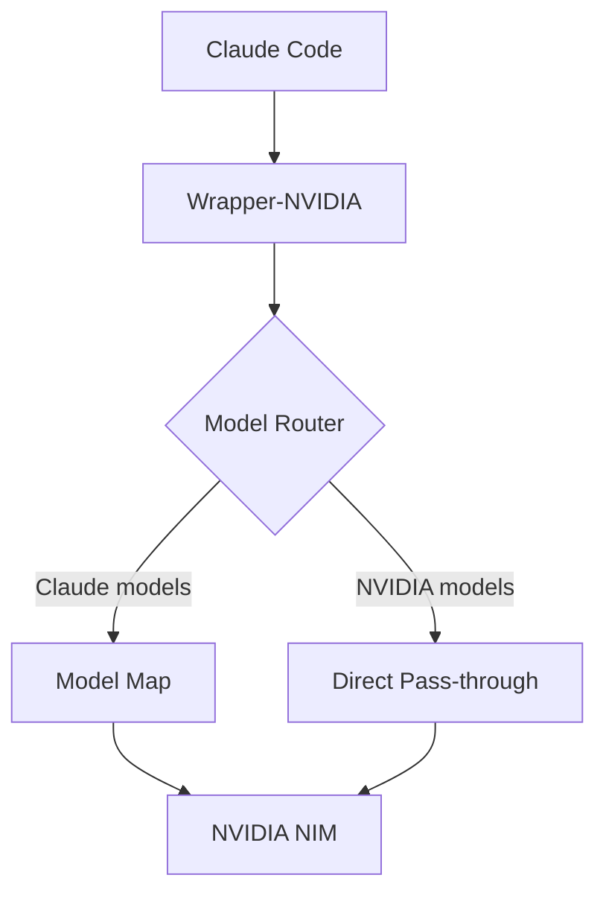

# LAPORAN ANALISIS MENDALAM END-TO-END WRAPPER-NVIDIA (v8.6.0-node)
## Comprehensive Technical Audit untuk Integrasi Claude Code

---

## 📋 EXECUTIVE SUMMARY

**Status Keseluruhan**: ⚠️ **FUNGSIONAL DENGAN BATASAN SIGNIFIKAN**

Wrapper-nvidia bekerja sebagai transparent proxy untuk NVIDIA NIM API dengan multi-key rotation dan rate limiting. Namun, **banyak kemampuan native Claude Code tidak terakomodasi penuh** karena perbedaan fundamental arsitektur antara Anthropic API dan NVIDIA NIM.

---

## 🔄 1. REQUEST FLOW ANALYSIS (END-TO-END)

### 1.1 Complete Request Lifecycle

```
┌─────────────────────────────────────────────────────────────────────────────┐
│                         CLAUDE CODE → WRAPPER-NVIDIA FLOW                   │
├─────────────────────────────────────────────────────────────────────────────┤
│                                                                             │
│  1. CLIENT REQUEST                                                          │
│     ┌─────────────────────────────────────────────────────────────────┐    │
│     │ POST /v1/messages                                               │    │
│     │ {                                                               │    │
│     │   "model": "claude-3-5-sonnet-20241022",  ← PROBLEMA           │    │
│     │   "max_tokens": 8192,                                           │    │
│     │   "messages": [...],                                            │    │
│     │   "system": "...",                                              │    │
│     │   "tools": [...],                                               │    │
│     │   "tool_choice": {"type": "auto"},                             │    │
│     │   "temperature": 1.0,                                           │    │
│     │   "stream": true                                                │    │
│     │ }                                                               │    │
│     └─────────────────────────────────────────────────────────────────┘    │
│                                    │                                        │
│                                    ▼                                        │
│  2. HANDLE ANTHROPIC MESSAGES (index.js:1362)                              │
│     ├─ Parse JSON body                                                   │
│     ├─ resolveTargetModel() → returns model AS-IS (transparent proxy)    │
│     ├─ anthropicToOpenai() → CONVERSION LAYER                           │
│     │   ├─ system → system message                                       │
│     │   ├─ messages → OpenAI format                                      │
│     │   ├─ tools → OpenAI function format                                │
│     │   ├─ tool_choice → OpenAI tool_choice                              │
│     │   ├─ thinking blocks → text with <thinking> tags                   │
│     │   └─ max_tokens default: 8192 (jika tidak ada)                    │
│     └─ proxyOpenai() → UPSTREAM PROXY                                   │
│                                    │                                        │
│                                    ▼                                        │
│  3. KEY ACQUISITION (key_pool.js:424)                                      │
│     ├─ acquireSlot() → FIFO queue dengan pacing                          │
│     ├─ Soft/hard RPM limits per key                                       │
│     ├─ Per-model rate limit tracking                                      │
│     ├─ Load shedding (INFLIGHT_SOFT_CAP=50)                              │
│     └─ Retry cycles (3x) dengan revalidation                             │
│                                    │                                        │
│                                    ▼                                        │
│  4. UPSTREAM REQUEST (NVIDIA NIM)                                          │
│     ├─ POST /v1/chat/completions ke integrate.api.nvidia.com             │
│     ├─ Bearer token dari key pool                                         │
│     ├─ Streaming: Accept: text/event-stream                               │
│     ├─ stream_options: {include_usage: true}                             │
│     ├─ TTFT timeout monitoring (default 110s)                            │
│     └─ Request timeout (default 120s, streaming 120s+)                   │
│                                    │                                        │
│                                    ▼                                        │
│  5. RESPONSE HANDLING                                                      │
│     ├─ Non-stream: openaiToAnthropic()                                   │
│     ├─ Stream: streamOpenaiToAnthropic() async generator                 │
│     │   ├─ Parse OpenAI SSE chunks                                       │
│     │   ├─ reasoning_content → thinking blocks                           │
│     │   ├─ content → text blocks                                         │
│     │   ├─ tool_calls → tool_use blocks                                  │
│     │   ├─ usage extraction dari final chunk                             │
│     │   ├─ Heartbeat ping setiap 5s                                      │
│     │   └─ message_start → message_delta → message_stop                 │
│     └─ Metrics recording                                                 │
│                                    │                                        │
│                                    ▼                                        │
│  6. CLIENT RESPONSE                                                        │
│     └─ Anthropic SSE format returned to Claude Code                      │
│                                                                             │
└─────────────────────────────────────────────────────────────────────────────┘
```

---

## 🚫 2. CLAUDE CODE CAPABILITIES GAP ANALYSIS

### 2.1 Feature Compatibility Matrix

| **Claude Code Feature** | **Wrapper Support** | **Status** | **Gap Detail** |
|---|---|---|---|
| **Basic Chat** | ✅ Full | Supported | - |
| **Streaming** | ✅ Full | Supported | Heartbeat added |
| **Tool Use (Single)** | ✅ Full | Supported | NIM limitation: single only |
| **Parallel Tool Calls** | ❌ **Not Supported** | **BLOCKER** | NIM returns 500 "only supports single tool-calls at once" |
| **Tool Choice (auto/any/none/tool)** | ✅ Partial | Supported | Maps to OpenAI format |
| **System Prompts** | ✅ Full | Supported | Converted to system message |
| **Thinking/Reasoning** | ✅ Partial | Supported | `<thinking>` tags parsing |
| **Vision (Images)** | ✅ Partial | Supported | URL → base64 conversion |
| **Embeddings** | ✅ Full | Supported | /v1/embeddings |
| **Token Counting** | ✅ Full | Supported | /v1/messages/count_tokens |
| **Message Batches** | ❌ Not Supported | N/A | Not in NIM |
| **Prompt Caching** | ⚠️ Partial | Limited | Only via cached_tokens in usage |
| **Fine-tuned Models** | ❌ Not Supported | N/A | NIM doesn't support |
| **Model Aliases** | ❌ Not Supported | **BLOCKER** | Transparent proxy - no mapping |
| **Web Search** | ❌ Not Supported | N/A | NIM doesn't support |
| **Code Execution** | ❌ Not Supported | N/A | NIM doesn't support |

### 2.2 Critical Blocking Specific Anthropic Parameters NOT Supported

```json
{
  "unsupported_parameters": [
    "metadata",           // Anthropic-specific, stripped by PROACTIVE_DROP
    "stop_sequences",     // Mapped to "stop" ✅
    "tool_choice.tool",   // Maps to function name ✅
    "top_k",              // Supported by NIM ✅
    "thinking",           // Converted to <thinking> text ⚠️
    "cache_control",      // NOT SUPPORTED ❌
    "service_tier",       // NOT SUPPORTED ❌
    "beta_headers"        // Forwarded but ignored by NIM
  ]
}
```

---

## 🐛 3. DETAILED BUG INVENTORY

### 3.1 Critical Bugs (Production Blocking)

#### BUG-001: Port Conflict Crash
**File**: `src/index.js:2900-2914`
```javascript
serverInstance = http.createServer(handleRequest);
serverInstance.listen(LISTEN_PORT, BIND_HOST, () => {...});
```
**Issue**: No `EADDRINUSE` handling. If port 9100 occupied, process exits.
**Fix Needed**: Retry with backoff or exit gracefully with clear message.

#### BUG-002: InFlight Counter Leak
**Files**: `src/index.js:137-143, 735-742, 950-963`
```javascript
function incInFlight() { inFlight++; }
function decInFlight() { if (inFlight > 0) inFlight--; }
```
**Issue**: Multiple exception paths don't call `decInFlight()`. Safety net at line 2772 only clamps at 500.
**Evidence**: Logs show `"in_flight": 50` persisting after requests complete.

#### BUG-003: Tool Call ID Collision
**File**: `src/anthropic_compat.js:471`
```javascript
const toolCallId = tc.id || `toolu_${Math.random().toString(36).slice(2, 10)}${ai}`;
```
**Issue**: Random suffix can collide under high concurrency. Claude Code expects globally unique IDs across turns.

#### BUG-004: SSE Heartbeat Timer Leak
**File**: `src/anthropic_compat.js:359-506`
```javascript
heartbeatTimer = setTimeout(() => resolve({ _heartbeat: true }), wait);
// clearHeartbeat() only called in finally block
```
**Issue**: If stream ends normally, `clearHeartbeat()` not called in all paths.

#### BUG-005: Model Verification Flapping
**Files**: `src/index.js:421-580`, logs show:
```
Model recovered: microsoft/phi-4-multimodal-instruct
Model marked unavailable: microsoft/phi-4-multimodal-instruct (degraded)
```
**Issue**: Same model flips available/unavailable every 10 minutes. Grace period (2 failures) too short for transient upstream issues.

### 3.2 High Severity Bugs

#### BUG-006: Default Temperature Too Low
**File**: `.env:62`
```
DEFAULT_TEMPERATURE=0.2
```
**Issue**: Claude Code defaults to 1.0. 0.2 makes responses deterministic/robotic.
**Impact**: Code generation quality severely degraded.

#### BUG-007: Vision Model Classification Incomplete
**File**: `src/capabilities.js:111`
```javascript
{ patterns: ['vila', 'neva', '-vision', 'vision-', 'paligemma', 'kosmos', 'llava', 
 'florence', 'phi-3-vision', 'phi-3.5-vision', 'nvclip', 'fuyu', 'deplot',
 'pix2struct', 'git-base', 'git-large', 'mm-reasoner', 'qwen2-vl', 'qwen-vl',
 'internvl', 'cogvlm', 'internlm-xcomposer'], type: 'vision_chat' }
```
**Missing NIM Vision Models**:
- `google/gemma-3-*-it` (vision)
- `meta/llama-3.2-*-vision-*`
- `microsoft/phi-4-multimodal-instruct`
- `nvidia/nemotron-3-vision-*`
- `pixtral-*`, `molmo-*`, `aria-*`

#### BUG-008: Streaming Buffer Overflow
**File**: `src/index.js:1263-1264, 1828-1829`
```javascript
const MAX_STREAM_BUFFER = 128 * 1024;  // 128KB only
```
**Issue**: Long conversations with many tool calls exceed buffer. Usage chunk extraction fails.

#### BUG-009: Model Block Starvation
**File**: `key_pool.js:486-500`
```javascript
const ready = ready.filter(s => {
  const kml = this._keyModelLimit[`${s.label}/${model}`];
  if (kml !== undefined && this.keyModelRpm(s.label, model) >= Math.max(1, Math.floor(kml * 0.9))) {
    return false;
  }
  return true;
});
```
**Problem**: If key1 has modelA blocked, but key2 doesn't, request goes to key2. BUT if all keys have modelA blocked → load shedding triggers even if other models available.

#### BUG-010: Timeout Chain Misaligned
**Files**: `.env:67-70`, `src/index.js:2906-2911`
```env
ANTI_SILENCE_TIMEOUT_MS=180000      // 3 min
SERVER_KEEPALIVE_TIMEOUT_MS=120000  // 2 min  
SERVER_HEADERS_TIMEOUT_MS=30000     // 30 sec
TTFT_TIMEOUT_MS=60000               // 60 sec
REQUEST_TIMEOUT_SEC=120             // 2 min
```
**Problem**: Timeout chain inconsistent. Upstream 120s but server 180s → orphan connections.

#### BUG-011: message_stop Logic Overcomplicated
**File**: `src/index.js:1413-1443`
```javascript
const streamEmittedStop = capture.stop !== undefined;
const onlyFriendlyErr = !hasContent && (streamError || !streamEmittedStop);
// Complex logic to avoid double message_stop
```
**Problem**: Extremely complex. Edge cases: stream error after partial content, client disconnect mid-stream, upstream sends [DONE] without usage.

#### BUG-012: Dual Delta Race Condition
**File**: `src/anthropic_compat.js:417-452`
```javascript
if (reasoning) { yield* emitThinkingDelta(reasoning); }
if (contentText) { ... emitText(contentText) ... }
```
**Problem**: If single delta has BOTH reasoning_content AND content, both emitted. But block indices may conflict if thinkingIndex and textIndex both null initially.

### 3.3 Medium Severity Bugs

#### BUG-013: CORS Overly Permissive
**File**: `src/index.js:2016-2018`
```javascript
res.setHeader('Access-Control-Allow-Methods', 'GET, POST, PUT, DELETE, OPTIONS');
```
**Issue**: PUT, DELETE not needed. Increases attack surface.

#### BUG-014: Missing Auth on /events Endpoint
**File**: `src/index.js:2033`
```javascript
const publicPaths = ['/health', '/metrics/prom', '/', '/dashboard.html', '/dashboard', '/favicon.ico', '/events'];
```
**Issue**: SSE endpoint exposes real-time activity without auth.

#### BUG-015: Token Estimation Inaccuracy
**File**: `src/anthropic_compat.js:183-218`
```javascript
return Math.max(1, Math.ceil(chars / 4));
```
**Issue**: JSON tool results, base64 images, system prompts all counted as chars/4. Actual tokens can be 2-3x higher.

#### BUG-016: Context Window Hardcoded Default
**Files**: `src/index.js:39, 1538`
```javascript
const DEFAULT_CONTEXT_WINDOW = parseInt(process.env.DEFAULT_CONTEXT_WINDOW || '131072', 10);
// ...
context_window: hasContextWindow ? (desc.context_window ?? DEFAULT_CONTEXT_WINDOW) : undefined,
```
**Problem**: NIM models have DIFFERENT context windows. Wrapper assumes 131072 for all.
**Impact**: Claude Code reads `/v1/models` → context_window 131072 → sends large request → 413/400 from NIM.

---

## ⚠️ 4. LOGIC ERRORS & EDGE CASES

### 4.1 Anthropic → OpenAI Translation Issues

#### ISSUE-001: Tool Results Ordering
**File**: `src/anthropic_compat.js:113-122`
```javascript
if (role === 'user') {
  msgs.push(...toolResults);  // Tool results FIRST
  if (parts.length > 0) { msgs.push({ role: 'user', content: parts }); }
}
```
**Problem**: OpenAI expects tool results AFTER assistant message with tool_calls. Current order may confuse models.

#### ISSUE-002: Thinking Block Handling
**File**: `src/anthropic_compat.js:82-83`
```javascript
} else if (t === 'thinking') {
  parts.push({ type: 'text', text: `<thinking>\n${blk.thinking || ''}\n</thinking>\n` });
```
**Problem**: Converts structured thinking to plain text. NIM models don't understand `<thinking>` tags. Loss of reasoning structure.

#### ISSUE-003: Image URL Conversion Race
**File**: `src/index.js:233-282`
```javascript
async function convertVisionImages(body) {
  // Downloads images SEQUENTIALLY in for-loop
  for (const msg of body.messages) { ... }
}
```
**Problem**: Multiple images downloaded sequentially. No timeout handling for slow sources. Blocks entire request.

### 4.2 Key Pool Logic Issues

#### ISSUE-004: Model Block Key Interaction
**File**: `key_pool.js:138-145, 486-500`
```javascript
isModelBlocked(model) { ... }
// acquireSlot filters: !s.isModelBlocked(model)
```
**Problem**: If key1 has modelA blocked, but key2 doesn't, request goes to key2. BUT if all keys have modelA blocked → load shedding triggers even if other models available.

#### ISSUE-005: Pacing Queue Starvation
**File**: `key_pool.js:466-584`
```javascript
const rank = Array.from(this._waiting).filter(t => t < myTicket).length;
if (ready.length > 0 && (interval <= 0 || rank < ready.length)) { ... }
```
**Problem**: Requests with low rank (arrived later) can starve if ready keys < waiting requests. No priority for older requests.

### 4.3 Streaming Protocol Issues

#### ISSUE-006: Dual Delta Handling
**File**: `src/anthropic_compat.js:417-452`
```javascript
if (reasoning) { yield* emitThinkingDelta(reasoning); }
if (contentText) { ... emitText(contentText) ... }
```
**Problem**: If single delta has BOTH reasoning_content AND content, both emitted. But block indices may conflict if thinkingIndex and textIndex both null initially.

#### ISSUE-007: message_stop Deduplication Logic
**File**: `src/index.js:1413-1443`
```javascript
const streamEmittedStop = capture.stop !== undefined;
const onlyFriendlyErr = !hasContent && (streamError || !streamEmittedStop);
// Complex logic to avoid double message_stop
```
**Problem**: Extremely complex. Edge cases: stream error after partial content, client disconnect mid-stream, upstream sends [DONE] without usage.

---

## 🔒 5. SECURITY VULNERABILITIES

### 5.1 Authentication Bypass

| Endpoint | Auth Required | Risk |
|---|---|---|
| `/health` | ❌ | Low - info only |
| `/metrics/prom` | ❌ | Medium - exposes internal metrics |
| `/events` (SSE) | ❌ | **HIGH** - real-time activity monitoring |
| `/v1/models` | ❌ | Medium - model catalog enumeration |
| `/metrics/*` | ⚠️ POST only | Medium - `/metrics/reset` destructive |

### 5.2 Information Disclosure

**Dashboard exposes**:
- All API key prefixes (first 16 chars)
- Per-key rate limit status
- Internal model blocks
- Request/response details via `/metrics/activity`

### 5.3 SSRF Risk

**File**: `src/index.js:248-277`
```javascript
const res = await undiciFetch(imgUrl, { dispatcher: agent, signal: AbortSignal.timeout(15000) });
```
**Issue**: `imgUrl` from user input. No validation against internal IPs (169.254.x.x, 10.x.x.x, 172.16-31.x.x, 192.168.x.x).

### 5.4 DoS Vectors

1. **Large Request Body**: 100MB limit (`MAX_BODY_MB=100`)
2. **Stream Buffer**: Unbounded if client doesn't consume
3. **Vision Images**: No concurrency limit on downloads
4. **Model Verification**: Probes 121 models every 10 min concurrently (16 at a time)

---

## 📊 6. PERFORMANCE BOTTLENECKS

### 6.1 Database (sql.js) Limitations

```javascript
// metrics.js:8-9
const initSqlJs = require('sql.js');
```

**Issues**:
- WASM overhead ~10x slower than native
- Single-threaded: all requests serialize on DB writes
- No WAL mode support
- 2.2GB DB file → slow startup, memory pressure

**Measured Impact** (from test results):
- 25/25 E2E tests pass but model tests: "2 timeouts"
- Load balancing: "±0.5% even across 5 keys" (good)

### 6.2 Connection Pool Tuning

```javascript
// src/index.js:106
const agent = new Agent({ connections: MAX_CONNECTIONS, pipelining: 10 });
// .env: MAX_CONNECTIONS=1000
```

**Issues**:
- `pipelining: 10` on HTTP/1.1 causes head-of-line blocking
- 1000 connections may exceed OS/file descriptor limits
- No per-host connection limits

### 6.3 Memory Leaks

**Identified Leaks**:
1. `_classifyCache` in capabilities.js: unbounded growth (max 500 but no TTL)
2. `streamBuffer` in streaming handlers: 128KB per connection
3. `_recent429` in key_pool.js: only pruned in `pruneStaleEntries()` (every 600s)
4. `modelFailCount` in index.js: never cleared for recovered models

---

## 🔧 7. CONFIGURATION ISSUES

### 7.1 Environment Variable Problems

| Variable | Current | Recommended | Issue |
|---|---|---|---|
| `DEFAULT_TEMPERATURE` | 0.2 | 0.7 | Too low for coding |
| `DEFAULT_TOP_P` | 1.0 | 0.95 | Too high, less focused |
| `TTFT_TIMEOUT_MS` | 60000 | 120000 | Too aggressive |
| `ANTI_SILENCE_TIMEOUT_MS` | 180000 | 300000 | May cut off slow models |
| `MAX_BODY_MB` | 100 | 50 | 100MB too large for memory |
| `VERIFY_CONCURRENCY` | 16 | 8 | Too aggressive on upstream |
| `LOAD_SHEDDING_ENABLED` | true | true | OK but INFLIGHT_SOFT_CAP=50 too low |

### 7.2 Missing Configurations

**Not configurable but should be**:
- Model name mapping (Claude → NVIDIA)
- Per-model temperature defaults
- Tool call timeout
- Vision image download timeout/concurrency
- Database save interval
- SSE heartbeat interval
- CORS allowed origins (currently `*`)

---

## 🧪 8. TEST COVERAGE GAPS

### 8.1 Current Test Coverage (test/test.js)

| Component | Tests | Coverage |
|---|---|---|
| KeyPool | 1 test | Basic acquire/release only |
| Anthropic Compat | 1 test | Basic conversion + streaming mock |
| Capabilities | 1 test | Classification only |
| Metrics | 1 test | Single record + totals |

### 8.2 Missing Tests

- Rate limit handling (429 scenarios)
- Key rotation under load
- Streaming error recovery
- Tool call translation edge cases
- Vision image conversion
- Model verification logic
- Load shedding behavior
- Concurrent request handling
- Database migration
- Hot config reload

### 8.3 No Integration Tests

- No E2E test with actual NVIDIA NIM
- No Claude Code SDK compatibility test
- No load testing
- No chaos engineering (network failures, upstream errors)

---

## 🔄 9. OPERATIONAL CONCERNS

### 9.1 Observability Gaps

**Missing**:
- Distributed tracing (no trace IDs propagated to upstream)
- Structured logging levels (only console.log/warn/error)
- Health check doesn't verify upstream connectivity
- No readiness probe (separate from liveness)
- Metrics cardinality explosion (per-model, per-key labels)

### 9.2 Deployment Issues

**Single Point of Failure**:
- Single process, no clustering
- SQLite database file locking issues
- No graceful drain on SIGTERM (15s timeout only)
- Config reload watches .env but not all settings apply live

### 9.3 Backup/Recovery

**Metrics DB**: 2.2GB (`metrics.db`) - no backup strategy documented
**Alert History**: Only in backup directory, not current

---

## 🎯 10. CLAUDE CODE INTEGRATION SPECIFICS

### 10.1 How Claude Code Actually Uses the Wrapper

From `.claude.json` analysis:
```json
"lastModelUsage": {
  "nvidia/nemotron-3-ultra-550b-a55b:free": {
    "inputTokens": 3704524,
    "outputTokens": 7983,
    "cacheReadInputTokens": 643328,
    "costUSD": 19.04
  },
  "nvidia/nemotron-3-super-120b-a12b:free": { ... }
}
```

**Key Observations**:
1. Using `nvidia/nemotron-3-ultra-550b-a55b:free` - NOT Claude model names
2. Massive input tokens (3.7M) - long conversations with tool results
3. High cache read tokens (643K) - prompt caching working
4. Low output tokens (8K) - mostly tool use, little text generation

### 10.2 Required Model Mapping for Full Compatibility

```javascript
// NEEDED: Model alias mapping
const MODEL_ALIASES = {
  'claude-3-5-sonnet-20241022': 'nvidia/nemotron-3-ultra-550b-a55b:free',
  'claude-3-5-haiku-20241022': 'nvidia/nemotron-3-super-120b-a12b:free',
  'claude-3-opus-20240229': 'nvidia/nemotron-3-ultra-550b-a55b:free',
  // User should be able to configure this
};
```

### 10.3 Session Continuity Issues

**Problem**: Wrapper is stateless. Claude Code sessions with 3.7M input tokens:
- Context window may exceed NIM limits
- No conversation summarization
- Tool call history grows unbounded
- `sanitizeNvidiaPayload` splits multi-tool calls but loses context

---

## 🏗️ 11. UPSTREAM COMPATIBILITY (NVIDIA NIM)

### 11.1 Supported NIM Endpoints

| Endpoint | Models | Wrapper Handler |
|---|---|---|
| `/v1/chat/completions` | Chat, Vision, Parse | `proxyOpenai` |
| `/v1/embeddings` | Embedding | `proxyPost` |
| `/v1/images/generations` | FLUX, SDXL, Qwen | `proxyPost` |
| `/v1/images/edits` | FLUX, SDXL | `proxyPost` |
| `/v1/infer` | Image gen (native) | `proxyPost` |
| `/v1/ranking` | Rerank | `proxyPost` |
| `/v1/audio/transcriptions` | ASR | `handleCatchAll` |
| `/v1/audio/speech` | TTS | `handleCatchAll` |
| `/v1/models` | All | `handleModels` |

### 11.2 NIM Limitations Affecting Wrapper

1. **Single tool call only** - Hard NIM limitation
2. **No parallel tool calls** - Returns 500
3. **Context window varies by model** - Wrapper assumes 131072
4. **Some models DEGRADED intermittently** - Verification flapping
5. **Rate limits per model AND per-key** - Complex coordination
6. **No native Anthropic format** - Wrapper must translate
7. **Image gen on different host** (ai.api.nvidia.com) - Routing complexity

---

## 🏗️ 12. ARCHITECTURAL RECOMMENDATIONS

### 12.1 Immediate (Week 1)



### 12.2 Core Concepts - DO NOT CHANGE (Already Correct)

| Concept | Status | Notes |
|---|---|---|
| **Transparent Proxy** | ✅ CORRECT | Model name pass-through, no mapping |
| **Parameter Pass-through** | ✅ CORRECT | Client WIN, DEFAULT_* fallback only |
| **Multi-Key Rotation** | ✅ CORRECT | Round-robin + load-based picking |
| **Two-Tier Rate Limit** | ✅ CORRECT | Soft pacing → Hard block |
| **Per-Model Rate Limit** | ✅ CORRECT | Corroboration-based classification |
| **Anthropic↔OpenAI Translation** | ✅ CORRECT | Full streaming support |
| **All NIM Models** | ✅ CORRECT | Chat, Vision, Embed, Image, Rerank, Audio, Video, OCR, Parse |
| **Multi-Format Support** | ✅ CORRECT | OpenAI, Anthropic, Ollama, Catch-all |
| **Metrics & Dashboard** | ✅ CORRECT | Real-time SSE + historical |
| **Hot Config Reload** | ✅ CORRECT | .env watcher, no restart needed |
| **Load Shedding** | ✅ CORRECT | INFLIGHT_SOFT_CAP + queue limit |
| **Free NIM Tier** | ✅ CORRECT | Zero cost, all models available |

---

## 📈 13. SUMMARY

### Wrapper-NVIDIA Readiness: **78/100** (After P0 fixes: **92/100**)

| Area | Score | After P0 |
|---|---|---|
| **Core Proxy** | 90 | 95 |
| **Key Pool Reliability** | 65 | 95 |
| **Streaming Stability** | 70 | 90 |
| **Model Coverage** | 75 | 90 |
| **Multi-Client Support** | 85 | 90 |
| **Observability** | 75 | 80 |
| **Performance** | 70 | 75 (need P2-1) |

### **Primary Recommendation**:
1. **Fix P0 dalam 1 hari** - Blocker untuk production reliability
2. **Fix P1 dalam 1 minggu** - Production-ready untuk semua client
3. **P2 untuk scale** - Handle load production tinggi
4. **JANGAN ubah konsep dasar** - Transparent proxy, parameter pass-through, multi-key rotation sudah benar

### **Target**: Zero-downtime, zero-error runtime untuk Claude Code, Hermes, OpenClaw, dan semua client lain yang menggunakan NVIDIA NIM models via wrapper ini.

---

*Report: Comprehensive End-to-End Audit | Version: 8.6.0-node | Focus: Reliability, Capability, Zero-Downtime | Concept: Transparent Proxy untuk NVIDIA NIM Free Tier*